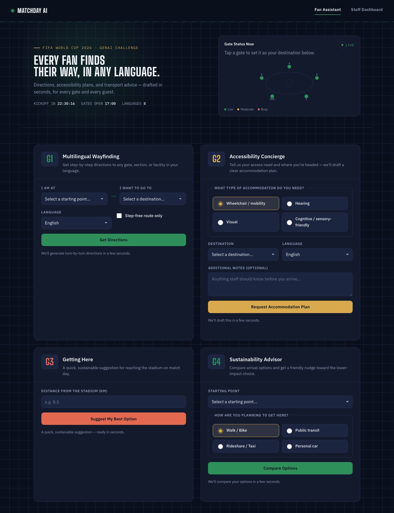
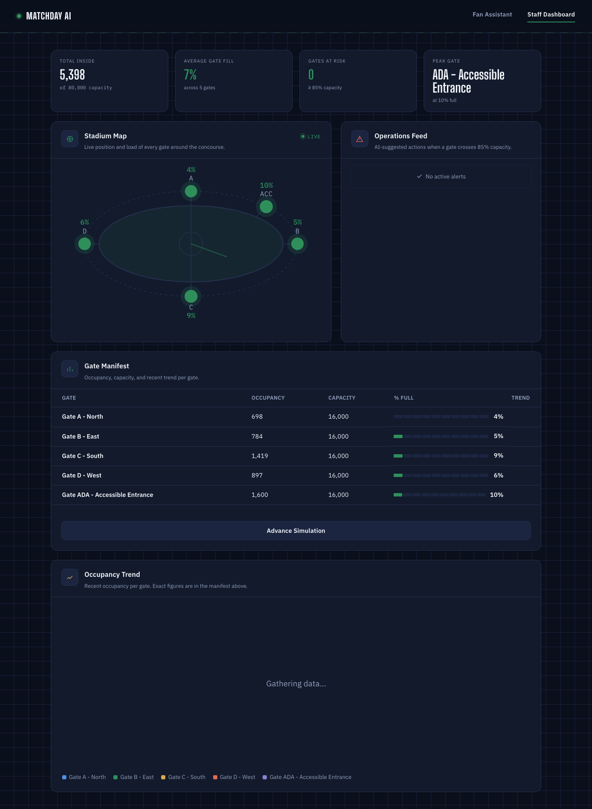

# MatchDay AI — Stadium Ops Assistant

Built for the FIFA World Cup 2026 GenAI Challenge.

A small set of focused, AI-assisted tools for match day — not a general chatbot — served by a
FastAPI backend with server-rendered pages and vanilla JS (no frontend build step, no client-side
framework).

## Table of contents

- [Problem](#problem)
- [Features](#features)
- [Screenshots](#screenshots)
- [Architecture](#architecture)
- [Request flow](#request-flow)
- [API reference](#api-reference)
- [Setup](#setup)
- [Configuration](#configuration)
- [Testing](#testing)
- [Security](#security)
- [Deployment (Railway)](#deployment-railway)
- [Project layout](#project-layout)

## Problem

On match day, fans and stadium staff face two different but related problems: fans need to
navigate an unfamiliar venue, sometimes across a language barrier or with an accessibility
need, while staff need real-time visibility into crowd density so they can act before a gate
becomes dangerously overcrowded. MatchDay AI addresses both with a small set of focused,
AI-assisted tools rather than a general chatbot.

## Features

| # | Feature | What it does |
|---|---------|---------------|
| 1 | **Multilingual Wayfinding** | Computes the shortest walking route through the stadium graph (Dijkstra's algorithm over `app/data/venue.json`), then asks Gemini to phrase the route as short, natural directions in the fan's chosen language (8 languages offered — the AI phrasing adapts, though the page layout itself isn't RTL-aware). Supports a step-free-only mode. |
| 2 | **Crowd Density + Decision Support** | A background simulation advances gate occupancy every 10 seconds. When a gate crosses 85% capacity, Gemini generates a one-sentence reroute/staffing suggestion for operations staff, shown live on the staff dashboard alongside an occupancy trend chart. |
| 3 | **Accessibility Concierge** | Matches a stated need (wheelchair, hearing, visual, cognitive) against accessible facilities in the venue data, then asks Gemini to draft a short, plain-language accommodation plan. |
| 4 | **Getting Here** | Suggests a transit option based on distance to the venue. |
| 5 | **Sustainability Advisor** | Ranks the fan's planned arrival mode (walk/bike, public transit, rideshare, personal car) against the others using a fixed, transparent low-to-high impact ordering (deliberately *not* a real emissions calculation — just enough to nudge behavior), then asks Gemini to turn that into 2-3 friendly sentences, naming a nearby sustainability touchpoint (bike parking, recycling point, water refill station) from `venue.json` when one exists. |

The live "Gate Status Now" mini-map on the fan assistant page and the staff dashboard both read
from the same crowd simulator, so a gate that's busy on one view is busy on the other.

## Screenshots

**Fan Assistant** — the four AI-assisted tools (wayfinding, accessibility, getting here,
sustainability), plus the live "Gate Status Now" mini-map:



**Staff Dashboard** — live occupancy per gate, AI-generated reroute alerts past 85% capacity, and
an occupancy trend chart:



## Architecture

```
                        ┌─────────────────────┐
   Fan / Staff  ──HTTP──▶│   FastAPI (main.py) │
     browser             │  CORS · rate limit  │
                        │  security headers    │
                        └─────────┬─────────────┘
                                  │
                   ┌──────────────┼───────────────┐
                   ▼              ▼               ▼
             routes/*.py    templates/*.html   static/{css,js}
             (thin, per            (Jinja2)     (fetch-based,
              feature)                          no build step)
                   │
                   ▼
             services/*.py  ── business logic (routing graph,
                                crowd sim, accessibility matching,
                                sustainability ranking)
                   │
                   ▼
             services/gemini.py ── the only module that touches
                                    the Gemini API / API key
```

Design choices worth calling out:

- **AI is a phrasing layer, not the decision-maker.** Routing (Dijkstra), crowd occupancy
  simulation, facility matching, and sustainability ranking are all deterministic Python. Gemini
  is only asked to turn already-computed, already-correct data into natural language. This keeps
  the app testable (routes/rankings are asserted exactly) and keeps Gemini from inventing facts
  like directions or facility names.
- **The Gemini API key never leaves the server.** It's read once via `app/config.py` (Pydantic
  Settings from `.env`) and used only inside `app/services/gemini.py`. No route, template, or
  client-side script ever sees it.
- **AI failures fail closed.** Every AI-calling route wraps `ask_gemini` in a
  `try/except RuntimeError` and returns a generic `502` — never the raw exception — so a Gemini
  outage degrades gracefully instead of leaking internals or 500ing.
- **No frontend build step.** Templates are server-rendered Jinja2; the four fan-assistant forms
  and the staff dashboard are plain `fetch()`-based JS. This keeps the whole stack running with a
  single `pip install` and no `npm`/bundler in the loop.

## Request flow

A typical AI-backed request (wayfinding, as an example):

1. Browser submits the form → `POST /api/wayfinding` with `start_node_id`, `target_node_id`,
   `language`, `require_step_free`.
2. `slowapi` checks the per-IP rate limit (`RATE_LIMIT_PER_MINUTE`, AI routes only).
3. `app/services/wayfinding.py` runs Dijkstra's algorithm over the venue graph — this is the
   *only* source of truth for the route, distance, and walk time.
4. The computed route is handed to `phrase_directions()`, which asks Gemini to phrase it
   naturally in the requested language.
5. On any Gemini failure (timeout, quota, network), the route request still fails with a `502`
   and a generic message — the fan never sees a stack trace.
6. The response (`route` + `directions`) is rendered into the structured result panel
   client-side (route-meta, numbered steps, then the AI-phrased text).

## API reference

All AI-calling endpoints are rate-limited to `RATE_LIMIT_PER_MINUTE` (default 20) requests/minute
per client IP, and return `429` past that limit.

| Method | Path | Body | Returns |
|--------|------|------|---------|
| `GET`  | `/` | — | Fan assistant page (HTML) |
| `GET`  | `/dashboard` | — | Staff dashboard page (HTML) |
| `POST` | `/api/wayfinding` | `start_node_id, target_node_id, language, require_step_free` | `{ route, directions }` |
| `POST` | `/api/accessibility/request` | `need_type, target_node_id, language, notes?` | `{ plan, facilities }` |
| `POST` | `/api/transport/suggest` | `distance_km, language` | `{ suggestion }` |
| `POST` | `/api/sustainability/advise` | `start_node_id, mode, language` | `{ comparison, guidance }` |
| `GET`  | `/api/crowd/status` | — | `{ gates, alerts }` — live occupancy per gate |
| `POST` | `/api/crowd/simulate-tick` | — | Advances the crowd simulation by one tick (demo/testing aid) |

Invalid request bodies return `422` with a generic `{"detail": "Invalid request"}` (no field-level
validation internals are leaked to the client).

## Setup

Requires Python 3.11+.

```bash
python3 -m venv venv
source venv/bin/activate
pip install -r requirements.txt
playwright install chromium   # only needed for the e2e suite

cp .env.example .env
# then set GEMINI_API_KEY in .env
```

Run the dev server:

```bash
uvicorn app.main:app --reload
```

Visit `http://localhost:8000` for the fan assistant, `http://localhost:8000/dashboard` for the
staff view.

## Configuration

All configuration is environment-driven via `app/config.py` (`pydantic-settings`, loaded from
`.env`):

| Variable | Default | Purpose |
|----------|---------|---------|
| `GEMINI_API_KEY` | _(empty)_ | Required for any AI-backed route to work. Without it, `ask_gemini` fails closed with a `502`. |
| `RATE_LIMIT_PER_MINUTE` | `20` | Per-IP rate limit applied to AI-calling routes. |
| `ALLOWED_ORIGINS` | `http://localhost:8000` | Comma-separated list of allowed CORS origins. |

## Testing

Unit/integration tests and the Playwright e2e suite are run as **separate invocations** —
Playwright's sync API and pytest-asyncio's event loop conflict when run in the same process.

```bash
pytest tests --ignore=tests/e2e --cov=app --cov-report=term-missing
pytest tests/e2e
```

- **Unit/integration** (`tests/*.py`): route computation, crowd simulation, accessibility
  matching, sustainability ranking, request validation, rate limiting — all with Gemini mocked at
  the boundary (`tests/conftest.py`'s `mock_gemini` fixture), plus a dedicated
  `tests/test_gemini.py` that exercises the real `ask_gemini`/`_get_client` logic itself
  (success, empty response, timeout, unexpected errors, missing API key) against a fake client.
- **E2E** (`tests/e2e/*.py`, Playwright): drives the actual rendered pages in a real browser —
  form submission → rendered AI response, live dashboard occupancy updates, keyboard tab order,
  and an axe-core scan asserting **zero accessibility violations** on both `/` and `/dashboard`.

Current coverage: **96%** on `app/` (backend). `app/services/gemini.py` — the module that talks
to the real API — is at 100%.

## Security

- The Gemini API key is read server-side only (`app/config.py` → `app/services/gemini.py`) and
  never reaches a template, route response, or client-side script.
- `CORSMiddleware` defaults to a single explicit origin (`http://localhost:8000`), not `*`.
- All AI-calling routes are rate-limited per client IP (`slowapi`).
- A `security_headers` middleware sets `Content-Security-Policy`, `X-Content-Type-Options`,
  `X-Frame-Options: DENY`, and `Referrer-Policy: no-referrer` on every response.
- Validation errors return a generic `422` message — Pydantic's internal field errors are never
  echoed back to the client.
- AI failures (timeout, quota, network) are caught and converted to a generic `502` — the raw
  exception is logged server-side only, never returned to the client.
- `.env` is git-ignored; only `.env.example` (no real values) is committed.

## Deployment (Railway)

1. Push this repo to GitHub.
2. Create a new Railway project from the repo (Railway auto-detects the `Procfile`).
3. In the Railway dashboard, set environment variables:
   - `GEMINI_API_KEY`
   - `ALLOWED_ORIGINS` (your Railway domain, e.g. `https://your-app.up.railway.app`)
   - `RATE_LIMIT_PER_MINUTE` (optional, defaults to 20)
4. Deploy, then confirm all core flows (wayfinding, accessibility concierge, getting here,
   sustainability advisor, staff dashboard) work end-to-end on the live URL before demo/judging.

Live URL: _add after deploying_

## Project layout

```
app/
  main.py                FastAPI app: routing, CORS, security headers, lifespan
  config.py               Pydantic Settings loaded from .env
  data/venue.json         Stadium graph: gates, sections, facilities, edges
  models/                 Pydantic models for venue data and API requests
  services/               Business logic: routing, crowd sim, accessibility, transport,
                           sustainability, and the Gemini wrapper
  routes/                 Thin FastAPI route handlers per feature
  middleware/             Rate limiter configuration
  templates/               Jinja2 pages (fan assistant, staff dashboard)
  static/
    css/style.css          Shared design system (CSS custom properties, dark stadium theme)
    js/                    Vanilla, fetch-based JS — one file per form/feature, no bundler
tests/
  test_*.py                Unit + integration tests (pytest, mocked Gemini)
  test_gemini.py            Unit tests for the real Gemini wrapper (client + error paths)
  e2e/                      Playwright end-to-end + axe-core accessibility tests
```
